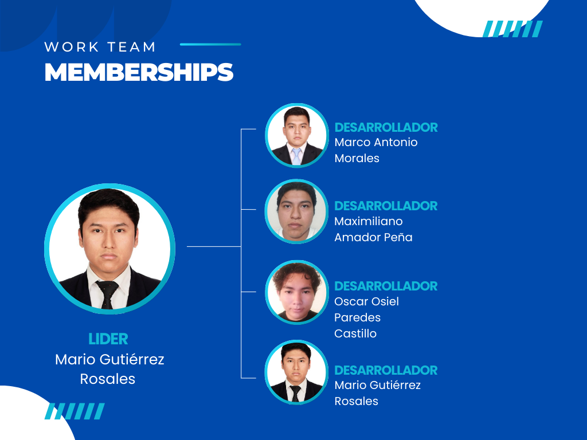

 
 

<h1 align="center"> Universidad Tecnológica de Xicotepec de Juárez </h1>
<h1 align="center"> Ingeniería en Desarrollo y Gestión de Software </h1>
<h1 align="center"> Tarea Integradora </h1>
<h2 align="center"> Decimo Cuatrimestre Grupo B </h2>
 

| NOMBRE DE LA EMPRESA         | MO-S                        | 
|------------------------------|-----------------------------|
| PROYECTO                     | Sitio Web GYM BULL´S        |           
| UNIDAD DE NEGOCIO            | Membresias                  |             

 
 

  
| LOGO DEl SITIO  | 
|:------------- |

  

 

## Organigrama del equipo

 

## Integrantes 

| Nombre Completo              | Empresa    |
|------------------------------|-------------|
| Mario Gutierrez Rosales      | Develop MO's|           
| Marco Antonio Morales Rivera | Develop MO's|            
| Oscar Osiel Paredes Castillo | Develop MO's|                      
| Maximiliano Amador Peña      | Develop MO's|

 

## Propuesta de Plan de Trabajo       

  

 

## Objetivo General
Desarrollar un módulo de membresías dentro del sistema web “GYM BULL’S”, que permita gestionar inscripciones, renovación, control de pagos y beneficios de los socios, en Xicotepec de Juárez.
## Objetivos Específicos
1.	Implementar un sistema que permita a los usuarios registrarse y renovar su membresía de forma automática
2.	Crear un sistema que permita configurar diferentes planes de membresía (mensuales, anuales, premium, etc.), con distintos precios, beneficios y restricciones.
3.	Integrar un sistema que registre los pagos de los socios, genere recibos y mantenga un historial de facturación accesible tanto para el usuario como para el personal administrativo.
4.	Crear una interfaz que permita al personal del gimnasio consultar rápidamente los datos de los socios, sus planes de membresía activos, y su historial de pagos.
5.	Desarrollar un portal donde los socios puedan ver y gestionar su cuenta, consultar sus pagos, renovar membresías y acceder a ofertas o beneficios exclusivos.

## Planteamiento del problema
En un mercado de fitness y bienestar, los gimnasios deben adaptarse a las necesidades cambiantes de los usuarios pertenecientes al gimnasio. La falta de un sitio web que centralice la información sobre membresías, sucursales, dietas, entrenamientos y la venta de productos puede limitar el crecimiento y la satisfacción del cliente, además del alcance que se puede llegar a tener simplemente de manera presencial. Para esto mismo es que se tiene pensado desarrollar un sitio web integral que sirva como un punto de acceso único para que los usuarios consulten información sobre membresías además de otra información como localizaciones de sucursales, planes de dieta y entrenamiento, así como para realizar compras de productos relacionados con el fitness. Este sitio web no solo debe mejoraría la experiencia del usuario, sino también aumentar la eficiencia operativa del gimnasio y sus ingresos de una manera exponencial.
Motivo por el cual surge la idea de integrar un sitio web donde se maneje la información de membresías, como precio de estas, lapso, beneficios, permite que se visualice más ampliamente el gimnasio y se obtengan clientes de manera más rápida, además de que permite un mejor manejo de administración tanto como de los miembros como el del administrador encargado del gimnasio.

## Requerimientos Funcionales
1. El sistema debe incluir validaciones para el CRUD de la información de los socios, asegurando que los formularios de inscripción y renovación sean completos y correctos.
2. El sistema debe mostrar un calendario con las fechas de renovación de membresías, así como las fechas de expiración de beneficios para facilitar el seguimiento de los socios.
3. Los socios deben poder realizar pagos en línea por la inscripción, renovación de membresías, clases adicionales y otros servicios, garantizando un procesamiento de pagos seguro.
4. El sistema debe proporcionar planes de membresía personalizados que se adapten a las necesidades y objetivos de cada socio, incluyendo beneficios específicos según su perfil.
5. Los nuevos socios deben poder registrarse con su información personal de forma clara e intuitiva, asegurando un proceso de inscripción fácil.
6. El sistema debe ofrecer un soporte al cliente en línea donde los socios puedan enviar consultas, reportar problemas o solicitar asistencia relacionada con sus membresías.
7. El sistema debe ofrecer múltiples opciones de pago para la renovación de membresías y otros servicios, incluyendo tarjetas de crédito, débito y métodos de pago en línea como PayPal.
8. Registro y Renovación Automática: Los socios podrán registrarse y renovar sus membresías automáticamente mediante el uso de métodos de pago predefinidos, garantizando que las membresías se mantengan activas sin interrupciones.
9. Configuración de Planes de Membresía: El sistema permitirá la creación de múltiples planes de membresía (mensuales, anuales, premium, etc.), cada uno con sus propios precios, beneficios y restricciones, que el personal administrativo podrá modificar según la demanda.
10. Registro y Generación de Pagos: Todos los pagos realizados por los socios se registrarán automáticamente en el sistema, generando recibos digitales que serán enviados al correo del usuario y almacenados en su historial de facturación.
11. Acceso a Historial de Pagos: Tanto los socios como el personal administrativo podrán acceder al historial de pagos de cada socio, lo que permitirá una gestión clara y transparente de las transacciones realizadas.
12. Consulta de Datos de Socios: El personal del gimnasio podrá consultar de manera rápida y eficiente los datos de los socios, incluyendo sus planes de membresía activos, estado de renovación e historial de pagos a través de una interfaz de usuario intuitiva.

## Requerimientos No Funcionales

1. Cifrado de datos personales y financieros: Toda la información sensible, como datos de pago y datos personales de los socios, deberá ser   encriptada utilizando algoritmos de encriptación robustos
2.	Autenticación segura: El sistema debe implementar un proceso de autenticación de usuarios mediante métodos seguros como autenticación basada en tokens JWT JSON Web Tokens.
3. Responsividad: La interfaz debe ser completamente responsiva, adaptándose a diferentes tamaños de pantalla.
4. Mantenimiento: El sistema debe permitir actualizaciones y mantenimiento con mínima interrupción del servicio, idealmente mediante despliegues continuos sin tiempo de inactividad visible para los usuarios.
5. Interfaz intuitiva: La interfaz debe ser diseñada para que tanto el personal administrativo como los socios puedan realizar las tareas más frecuentes (como consultar membresías, realizar pagos, etc.).
6.	Registro de actividades: El sistema debe registrar todas las actividades críticas (registro, renovación de membresías, pagos, modificaciones de planes) en un log que sea accesible para auditoría y monitoreo por parte del equipo administrativo.
7. Cumplimiento normativo: El procesamiento de pagos deberá cumplir con el estándar PCI DSS (Payment Card Industry Data Security Standard) para garantizar la seguridad en transacciones de tarjetas de crédito y débito.
8. Tolerancia a fallos: El módulo debe estar diseñado para detectar fallos y continuar operando con funcionalidades críticas, garantizando la mínima interrupción del servicio.
9. Crecimiento de la base de datos: El sistema debe poder manejar una base de datos creciente sin pérdida de rendimiento, con capacidad para almacenar grandes volúmenes de datos históricos (pagos, renovaciones, inscripciones, etc.).
10. Procesamiento de pagos en tiempo real: El sistema debe procesar los pagos en línea en tiempo real, con una confirmación de pago instantánea para el usuario.
11. Feedback inmediato: El sistema debe proporcionar mensajes de feedback claros e inmediatos en caso de errores o acciones exitosas (ejemplo: "Pago realizado con éxito", "Error en el registro de membresía, por favor revisa los campos").

# Desarollo
## Backend
El backend de la aplicación móvil para la gestión de membresías de GYM BULL'S fue desarrollado utilizando FastAPI, un framework moderno y de alto rendimiento basado en Python, ideal para construir APIs RESTful y aplicaciones web. Esta elección garantiza un sistema escalable, seguro y de fácil mantenimiento, diseñado para cubrir eficientemente las necesidades del gimnasio, tanto en la administración interna como en la interacción con los usuarios de la aplicación.

## Frontend
El frontend de la aplicación móvil para la gestión de membresías de GYM BULL'S fue desarrollado utilizando React Native, un framework basado en JavaScript ampliamente reconocido por su capacidad para crear aplicaciones móviles nativas con interfaces dinámicas, interactivas y altamente responsivas. Este enfoque permitió diseñar una experiencia de usuario moderna, intuitiva y eficiente, orientada a satisfacer las expectativas de los usuarios y optimizar la administración del gimnasio desde dispositivos móviles.

## Boceto

 

## Wireframe

 

 

 

## Prototipo

## Inicio:

 

## SplashScreen:

 

## Inicio de Sesión:

 

## Registrarse:

 

## Cambiar Contraseña:

 

## Home:

 

## Crear:

 

## Leer:

 

## Actualizar:

 

## Eliminar:

 

## Logout:

 

## Graficas:

 

